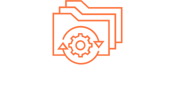

<div align="center">
    
    <br><br>
    <p>A Bash script that adds some packages and applications for gamers and game developers.</p>
</div>


<br><br><br>


<div>
    <h2>Installation</h2>
    <br>
    <p>First of all, to be able to run your project, make sure you have git installed on your computer.</p>

```bash
    sudo apt install git && git --version
```

<p>With git installed, clone the repository.</p>

```bash
    git clone https://github.com/Ismael-Moreira-Kt/Ubuntu-Gamer
```
</div>


<br><br><br>


<div>
    <h2>Using</h2>
    <br>
    <p>Enter the source code folder.</p>

```bash
    cd source-code
```

<p>Give setup execute permissions.</p>

```bash
    chmod +x setup
```

<p>Run the project.</p>

```bash
    ./setup
```

<p>You will see this menu in the terminal.</p>

<div align="center">
    
</div>

<p>By selecting option 1, the packages started to be installed.</p>
<p>If you select option 2, it will show you the list of packages to install.</p>

<div align="center">
    
</div>

<p>The third option adds some simple customized scripts to make everyday life easier, such as:</p>

<ul>
    <li><b>upd-sys:</b> It abstracts update, upgrade, autoremove and autoclean.</li>
    <li><b>dropbox:</b> Open dropbox.</li>
    <li><b>Ryujinx:</b> Open Ryujinx.</li>
    <li><b>Snes9x:</b> Open Snes9x.</li>
</ul>
</div>


<br><br><br>


<div>
    <h2>License</h2>
    <p>This project uses the Apache 2.0 License.</p>
</div>